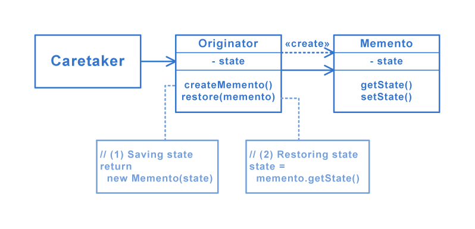

# [Memento pattern](https://en.wikipedia.org/wiki/Memento_pattern)
The memento pattern is a software design pattern that provides the ability to restore an object to its previous state (undo via rollback).

## Structure

