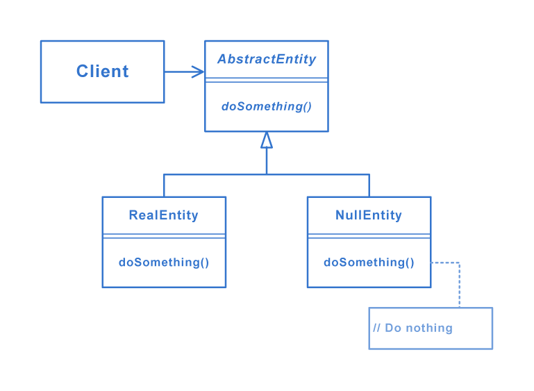

# Null object pattern
In object-oriented computer programming, a null object is an object with no referenced value or with defined neutral ("null") behavior. The null object design pattern describes the uses of such objects and their behavior (or lack thereof).

## Structure

