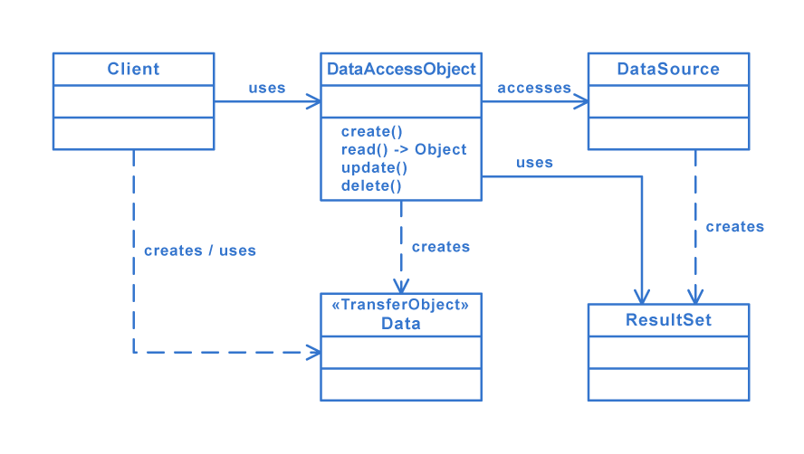

# [Data access object](https://en.wikipedia.org/wiki/Data_access_object)
In computer software, a data access object (DAO) is a pattern that provides an abstract interface to some type of database or other persistence mechanism. By mapping application calls to the persistence layer, the DAO provides some specific data operations without exposing details of the database. This isolation supports the single responsibility principle. It separates what data access the application needs, in terms of domain-specific objects and data types (the public interface of the DAO), from how these needs can be satisfied with a specific DBMS, database schema, etc. (the implementation of the DAO).

## Structure

