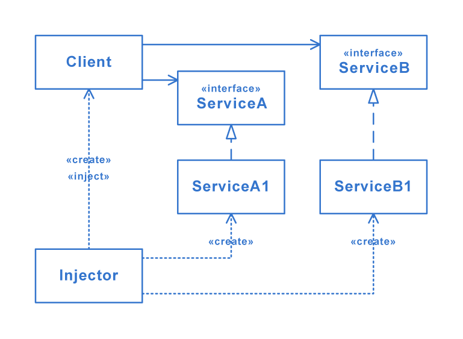

# [Dependency injection](https://en.wikipedia.org/wiki/Dependency_injection)
In software engineering, dependency injection is a technique in which an object receives other objects that it depends on. These other objects are called dependencies. In the typical "using" relationship the receiving object is called a client and the passed (that is, "injected") object is called a service. The code that passes the service to the client can be many kinds of things and is called the injector. Instead of the client specifying which service it will use, the injector tells the client what service to use. The "injection" refers to the passing of a dependency (a service) into the object (a client) that would use it.

## Structure

